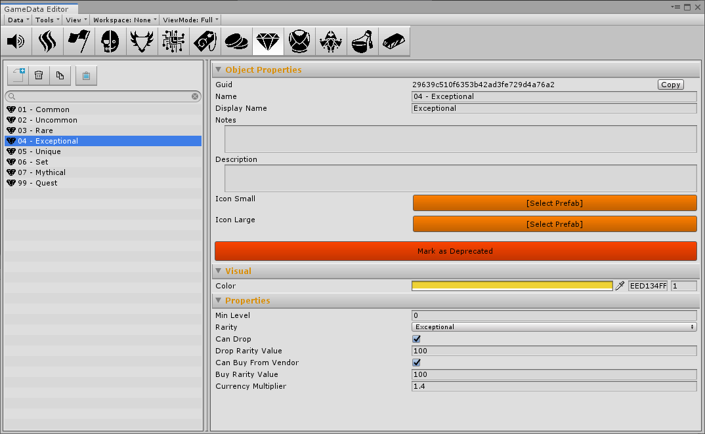
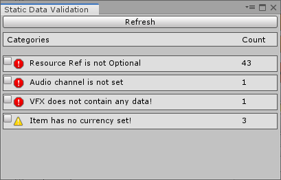
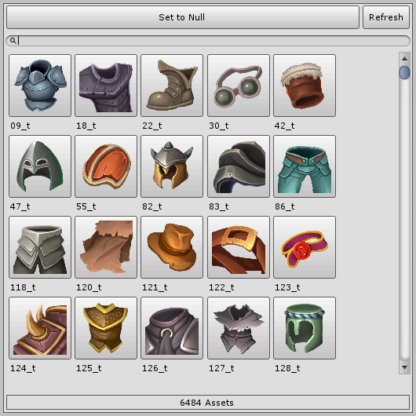

# Craiel Unity GameData

GameData Library for Unity to facilitate editing and iteration on game related data.

A Sample Project can be found here: https://github.com/Craiel/UnityGameDataExample

### Features

Plug + Play Editor with several features to facilitate editing (Copy, Paste, Clone, Search, Batch editing etc)


Data Validation



Custom Pickers with support for most Asset types including Animations (also supports multiple animation clips per fbx)


## Getting Started

Add the package and dependencies to your Project Manifest.json:
```
{
    "dependencies": {
    ...
    "com.craiel.unity.essentials": "https://github.com/Craiel/UnityEssentials.git",
    "com.craiel.unity.gamedata": "https://github.com/Craiel/UnityGameData.git",
    ...
  }
}
```


### Configuration

Before use the Library will have to be configured.
To Configure the Library add a class implementing `IGameDataEditorConfig` in the project:

```
    [UsedImplicitly]
    public class GameDataEditorConfig : IGameDataEditorConfig
    {
        // This enum is used to split the data into groups in the UI, useful when a project has a lot of different data classes
        private enum DataWorkspace
        {
            Visual = 1,
            Gameplay
        }
        
        // -------------------------------------------------------------------
        // Public
        // -------------------------------------------------------------------
        public void Configure()
        {
            GameDataBuilder.TargetFile = DRConstants.GameDataDataFile;

            foreach (DataWorkspace workspace in Enum.GetValues(typeof(DataWorkspace)))
            {
                GameDataEditorWindow.AddWorkSpace((int)workspace, workspace.ToString());
            }
            
            // Add these if you are using the Craiel Audio + VFX Packages
            //GameDataEditorWindow.AddContent<GameDataAudio>("Audio", (int)DataWorkspace.Visual);
            //GameDataEditorWindow.AddContent<GameDataVFX>("VFX", (int)DataWorkspace.Visual);
            
            GameDataEditorWindow.AddContent<GameDataArea>("Area", (int)DataWorkspace.Gameplay);
            GameDataEditorWindow.AddContent<GameDataCharacter>("Character", (int)DataWorkspace.Gameplay);
            GameDataEditorWindow.AddContent<GameDataMonster>("Monster", (int)DataWorkspace.Gameplay);
            GameDataEditorWindow.AddContent<GameDataItem>("Item", (int)DataWorkspace.Gameplay);
            GameDataEditorWindow.AddContent<GameDataTag>("Tag", (int)DataWorkspace.Gameplay);
        }
    }
```

Data Classes have to inherit `GameDataObject` and should also have a custom inspector inheriting from `GameDataObjectEditor`

To access the data at runtime you have to also register it at runtime, for example in `IEssentialConfig.Configure()`

```
    GameRuntimeData.RegisterData<RuntimeAudioData>();
    GameRuntimeData.RegisterData<RuntimeVFXData>();
            
    GameRuntimeData.RegisterData<RuntimeAreaData>();
    GameRuntimeData.RegisterData<RuntimeMonsterData>();
    GameRuntimeData.RegisterData<RuntimeCharacterData>();
    GameRuntimeData.RegisterData<RuntimeItemData>();
    GameRuntimeData.RegisterData<RuntimeTagData>();
```

### Usage

Once the data has been registered in the configuration and at runtime you can access it through the GameRuntimeData class:

```
    // Fetch all data entries of type RuntimeAreaData
    IList<RuntimeAreaData> areaDataEntries = new List<RuntimeAreaData>();
    if (GameRuntimeData.Instance.GetAll(areaDataEntries))
    {
        return;
    }
```

Each data entry will be assigned a `GameDataId` when the data is build, this can be used to query specific data objects at any time:
```
    // The type has to be specified and will be validated by the system
    GameRuntimeData.Instance.Get<RuntimeItemData>(itemDataId)
```

Several utility classes know how to work with `GameDataId` like the Audio System and use it as the basis for Managed calls.

## Contributing

Please read [CONTRIBUTING.md](CONTRIBUTING.md) for details on our code of conduct, and the process for submitting pull requests to us.


## License

This project is licensed under the MIT License - see the [LICENSE.md](LICENSE.md) file for details
